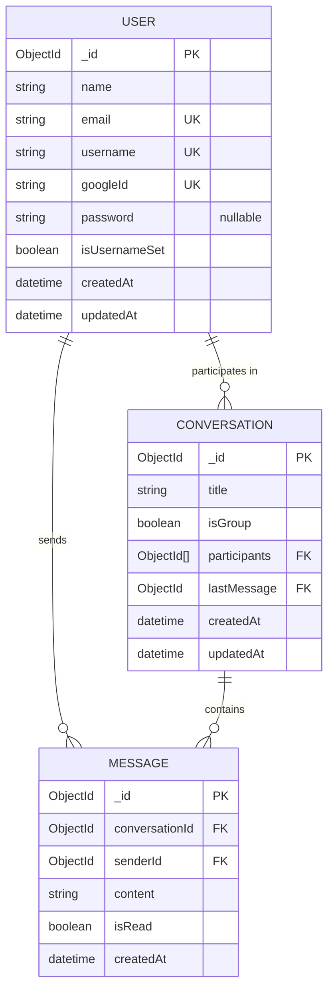
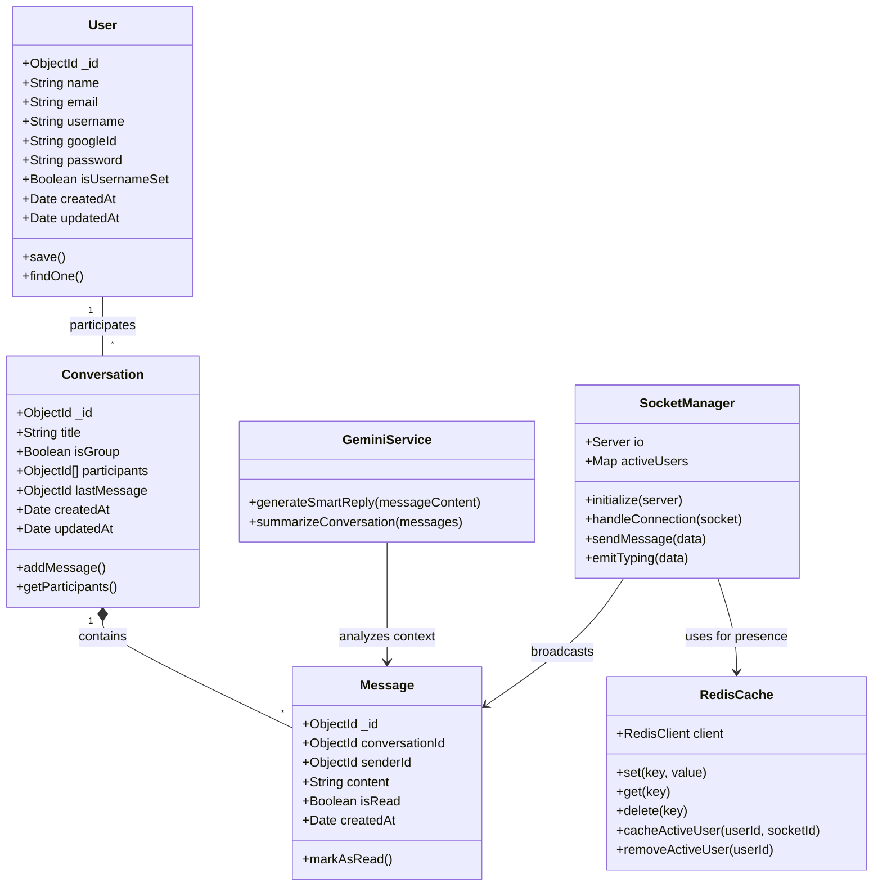

# ChatSphere Architecture Definitions

To support real-time chat, AI integration, and active caching, this document defines the relationships between all database entities and service modules within the system.

## Entity-Relationship (ER) Diagram

The ER Diagram outlines how MongoDB collections interface with one another.

## UML Class Diagram

This diagram visualizes the backend structure connecting standard Mongoose schemas to dynamic, stateful layers like Redis caches and Socket networks.

