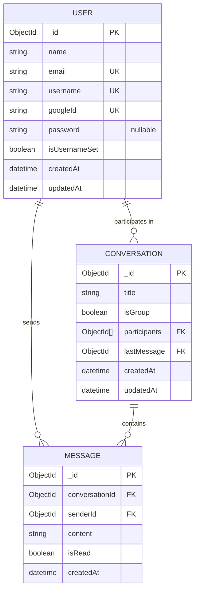
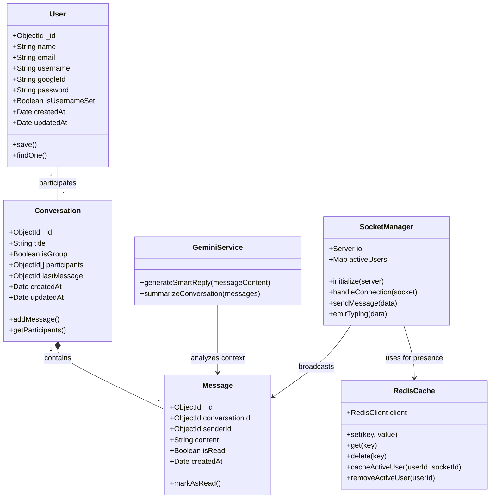

# 🌐 ChatSphere

**ChatSphere** is a scalable, type-safe, real-time chat ecosystem built with the **MERN stack** and **TypeScript**. It integrates **Google Gemini** for AI-driven insights, **Socket.io** for instant messaging, and **Redis** to ensure high-performance caching.

---

## 🚀 Key Features

* **Full-Stack TypeScript:** End-to-end type safety for both the React frontend and Express backend.
* **Google OAuth 2.0:** Seamless Sign-In/Sign-Up integration for a frictionless user experience.
* **Real-time Messaging:** Low-latency bidirectional communication via **Socket.io**.
* **AI-Assisted Conversations:** Integrated **Google Gemini API** for intelligent chat summaries and smart replies.
* **Performance Optimization:** **Redis** caching for session management and rapid data retrieval.
* **System Architecture:** Includes structured diagrams for WebSocket event flows and Redis caching layers.
* **Secure Auth:** JWT-based authentication combined with Google OAuth provider strategies.

---

## 🏗️ System Architecture

ChatSphere is architected for scalability and reliability:

1.  **Identity Layer:** Handles Google OAuth callbacks and maps them to MongoDB user documents.
2.  **Client (React + TS):** Uses Hooks and Context API to manage real-time socket states and auth status.
3.  **Server (Express + TS):** Compiled via `tsc` or executed via `ts-node-dev` for development.
4.  **Real-time Layer:** WebSocket events are strictly typed to prevent payload mismatches.
5.  **Cache Layer (Redis):** Stores transient data (typing indicators, active users) to reduce MongoDB overhead.

---

## 🛠️ Tech Stack

| Layer | Technology |
| :--- | :--- |
| **Language** | TypeScript (Strict Mode) |
| **Frontend** | React.js, Tailwind CSS, Redux Toolkit |
| **Backend** | Node.js, Express.js |
| **Auth** | Google OAuth 2.0, Passport.js / JWT |
| **Database** | MongoDB (Mongoose for Type-Safety) |
| **Real-time** | Socket.io |
| **Caching** | Redis |
| **AI Engine** | Google Gemini Pro API |

---

## 🏁 Getting Started

### Prerequisites
* **Node.js** (v18+)
* **MongoDB** (Local or Atlas)
* **Redis Server**
* **Google Cloud Console Credentials** (Client ID & Secret)
* **Google Gemini API Key**

### Installation & Setup

1.  **Clone the repository:**
    ```bash
    git clone [https://github.com/your-username/chatsphere.git](https://github.com/your-username/chatsphere.git)
    cd chatsphere
    ```

2.  **Configure Environment:**
    Create a `.env` file in the `/server` directory:
    ```env
    PORT=5000
    MONGO_URI=your_mongodb_uri
    JWT_SECRET=your_secret_key
    REDIS_URL=redis://localhost:6379
    GEMINI_API_KEY=your_gemini_api_key
    GOOGLE_CLIENT_ID=your_google_client_id
    GOOGLE_CLIENT_SECRET=your_google_client_secret
    CALLBACK_URL=http://localhost:5000/api/auth/google/callback
    ```

3.  **Install & Build:**
    ```bash
    # Install Backend Dependencies
    npm install

    # Install Frontend Dependencies
    cd client
    npm install
    ```

4.  **Run Development Servers:**
    ```bash
    # Run Backend (using ts-node-dev)
    npm run dev

    # Run Frontend (in a separate terminal)
    cd client
    npm run dev
    ```

---

## 🧠 Implementation Highlights

### Google OAuth Flow
We leverage a secure OAuth 2.0 flow where the server validates the Google ID Token, checks for an existing user in MongoDB, and issues a custom JWT for session persistence.

### Type-Safe Sockets
We define interfaces for every Socket event to ensure the payload sent from the client matches the expected type on the server:


# ChatSphere Architecture Definitions

To support real-time chat, AI integration, and active caching, this document defines the relationships between all database entities and service modules within the system.

## Entity-Relationship (ER) Diagram

The ER Diagram outlines how MongoDB collections interface with one another.



## UML Class Diagram

This diagram visualizes the backend structure connecting standard Mongoose schemas to dynamic, stateful layers like Redis caches and Socket networks.


